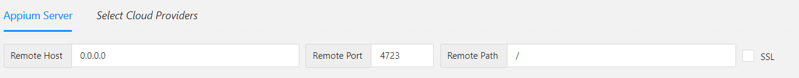
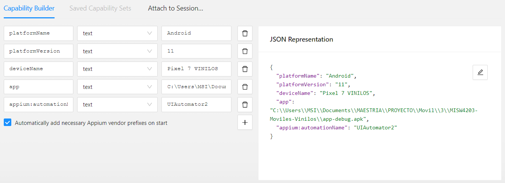
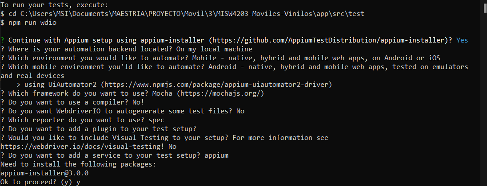

# [Moviles - Vinilos](https://github.com/CristianAAV/MISW4203-Moviles-Vinilos/wiki/Home)

## Integrantes:

| Nombres                       | Correo                      |
|-------------------------------|-----------------------------|
| Juan Camilo Vallejos Guerrero | j.vallejosg@uniandes.edu.co |
| Oscar Ivan Manco Racines      | o.manco@uniandes.edu.co     |
| Emerson Chaparro Ampa         | e.chaparroa@uniandes.edu.co |
| Cristian Arnulfo Arias Vargas | ca.ariasv1@uniandes.edu.co  |

## Requisitos generales del sistema
Para la instalacion de los requerimentos generales puedes seguir este [Video Tutorial](https://www.youtube.com/watch?v=tFcmRVWts4Q)
#### Node JS

Necesitamos node js para descargar la versión beta y los controladores de Appium fácilmente.

* Descargar[ Node Js](https://nodejs.org/en/download) dependiendo de su sistema operativo.
* Recomendacion: Descargar la version LTS de Node.Js

#### Java JDK & JAVA_HOME variable  de entorno

Necesitamos descargar JDK para la ejecucion del Android Studio y los controladores de Appium
fácilmente.

* [Open JDK](https://openjdk.org)
* [JAVA_HOME setup for Windows](https://confluence.atlassian.com/doc/setting-the-java_home-variable-in-windows-8895.html)
* [JAVA_HOME setup for Mac](https://mkyong.com/java/how-to-set-java_home-environment-variable-on-mac-os-x/)
* [JAVA_HOME setup for Linux](https://medium.com/@aarnlpezsosa/instalación-de-java-jdk-y-configuración-de-java-home-en-ubuntu-18-04-f3307c07328)

## Android Setup

#### Android Studio & ANDROID_HOME variable de entorno

Realizaremos la instalacion del entorno de desarrollo en este caso el Android Studio y adicionaremos
la variable de entorno ANDROID_HOME.

* [Android Studio](https://developer.android.com/studio?hl=es-419&gclsrc=aw.ds&gclid=Cj0KCQjwyOuYBhCGARIsAIdGQRNrDv20QvoOy_-I5E1LoZdOLu3nvhlwX_7EjPeHcE1kGQNNcIVOme0aAqckEALw_wcB)
* [ANDROID_HOME setup for Windows](https://www.testingdocs.com/setting-android_home-environment-variable-on-windows/)
* [ANDROID_HOME setup for Mac](https://stackoverflow.com/questions/19986214/setting-android-home-enviromental-variable-on-mac-os-x)
* [ANDROID_HOME setup for Linux](https://www.galisteocantero.com/variable-de-entorno-android-home-en-ubuntu/)

#### Download Appium Inspector

Para poder encontrar los localizadores correctos para mapear elementos, necesitarás tener esta
herramienta instalada en tu computadora.
Tenemos la Url del repositorio del framework del Appium Inspector:

* [Appium Inspector](https://github.com/appium/appium-inspector)
  Tenemos la Url de los release del framework del Appium Inspector para que los puedas descargar
  segun tu sistema operativo:
* [Appium Inspector Release](https://github.com/appium/appium-inspector/releases)
  Una ves instalada procedemos a realizar la configuracion, para este proyecto puede utilizar la
  siguiente configuración:

| Server Key  | Server Value |
|-------------|--------------|
| Remote Host | 0.0.0.0      |
| Remote Port | 4724         |
| Remote Path | /            |

Imagen de referencia:


Capacidades deseadas de Android (ejemplo)

| Clave de capacidad deseada | Valor de capacidad deseado     |
|----------------------------|--------------------------------|
| platformName               | Android                        |
| platformVersion            | [OS VERSION / IMAGE]           |
| deviceName                 | [EMULATED_DEVICE_NAME]         |
| app                        | /[PROJECT_PATH]/[APP_NAME].apk |
| appium:automationName      | UIAutomator2                   |

Las caracteristicas como las obtienes del dispositivo que crees en tu Android Studio para este
ejemplo tendriamos las siguientes:
platformVersion: 11
deviceName: Pixel 7 VINILOS
app: C:\\Users\\MSI\\Documents\\MAESTRIA\\PROYECTO\\Movil\\3\\MISW4203-Moviles-Vinilos\\app-debug.apk

Imagen de referencia:



* Instalar [Appium 2](https://appiumpro.com/editions/122-installing-appium-20-and-the-driver-and-plugins-cli) by Node JS(Beta):
```bash
    npm install -g appium@next
```
Verifique la versión de appium usando
```bash
    appium -v
```

#### Appium Doctor
Para comprobar si su sistema operativo cumple con los requisitos de appium, instale este paquete de nodo.
* [Appium Doctor Package](https://github.com/appium/appium-doctor)
  Instálalo usando el comando
```bash 
npm install appium-doctor -g
```
Y luego usa la biblioteca:
```bash 
appium-doctor
```


#### Appium drivers
Si desea que Appium funcione correctamente, debe descargar y tener el controlador de Android/IOS en su sistema.
Ejecute los comandos:
```bash 
appium driver install xcuitest
appium driver install uiautomator2
```
Verifique los controladores instalados usando
```bash 
appium driver list
```


[Aplicación de demostración WebdriverIO para iOS y Android](https://github.com/webdriverio/native-demo-app)

***Nota IMPORTANTE:***
Para IOS necesitarás una compilación de aplicación para ejecutarla en simuladores, pero un archivo .IPA para ejecutarla en dispositivos reales. Requería capacidades adicionales deseadas, y puede ver cuáles en el siguiente artículo: [Configuración del dispositivo real del controlador Appium XCUITest
](https://appium.io/docs/en/drivers/ios-xcuitest-real-devices/)

## Configurar WebDriverIO

1- Ejecute el comando para crear el package.json y continúe con el proceso de instalación.

* Ejecutamos una consola de comandos en modo administrador, y nos ubicamos en la carpeta test`MISW4203-Moviles-Vinilos\app\src\test`  del repositorio 

```bash
npm init wdio .
```
2- Usando el Asistente de configuración de WDIO, seleccione las opciones que desea seleccionar. En este caso se uso:

🤖 WDIO Configuration Wizard 🧙
===============================

? Continue with Appium setup using appium-installer (https://github.com/AppiumTestDistribution/appium-installer)? Yes ##Directorio y nombre del proyecto de pruebas

? Where is your automation backend located? On my local machine ##Ejecucion del backend en local

? Which environment you would like to automate? Mobile - native, hybrid and mobile web apps, on Android or iOS ## Tipo de aplicacion

? Which mobile environment you'ld like to automate? Android - native, hybrid and mobile web apps, tested on emulators ## Sistema de la aplicacion
and real devices

  |> using UiAutomator2 (https://www.npmjs.com/package/appium-uiautomator2-driver)
  
? Which framework do you want to use? Mocha (https://mochajs.org/) ## Framework de pruebas

? Do you want to use a compiler? No! ## Uso de compilador

? Do you want WebdriverIO to autogenerate some test files? No ##Autogenerar archivos de test.

? Which reporter do you want to use? spec ## Tipo de reportes.

? Do you want to add a plugin to your test setup? ## sin plugins 

? Would you like to include Visual Testing to your setup? For more information see
https://webdriver.io/docs/visual-testing! No

? Do you want to add a service to your test setup? appium ## Servicio de pruebas Appium

Need to install the following packages: ## Instalacion de dependencias.

appium-installer@3.0.0

Ok to proceed? (y) y 

Algo asi debe ser


* Una ves finalizado la instalacion de dependecias seleccionar exit. 


* Instala Appium, Appium-service y otras dependencias en tu proyecto
```bash
npm install --save-dev appium@next
npm install @wdio/appium-service --save-dev
npm install chai --save-dev
npm install --save-dev @wdio/local-runner
```


* Verifique si los controladores aún están disponibles, si no, instálelos nuevamente:
```bash 
appium driver list
```
En caso de que no se encuentren los Drivers instalados ejecutar los comandos.
```bash 
appium driver install xcuitest
appium driver install uiautomator2
```

3- Añade tus pruebas en
```bash
'./[yourProject]/specs/**/*.js'
```


4- Configure la ruta de la aplicación en wdio.conf.js
*Declarar donde va a estar ubicado
```bash
const projectPath = require('path')
const androidAppPath = projectPath.join(process.cwd(), "app/android/Android-MyDemoAppRN.1.3.0.build-244.apk")
const iosAppPath = projectPath.join(process.cwd(),"app/ios/MyRNDemoApp.app");
```

* Configurar las capacidades para Android (muestra de emulador)
```bash
capabilities: [{
        platformName: 'Android', 
        "appium:device-name": 'Pixel 4 API 30(R)',
        "appium:platformVersion": "11.0",
        "appium:automationName": "UIAutomator2",
        "appium:app": androidAppPath,
        // "appium:appWaitActivity": "com.swaglabsmobileapp.MainActivity"(For OLD swaglabs app)
    }]
```
* Configurar las capacidades para Android (muestra de emulador)

```bash
capabilities: [{
        platformName: 'IOS',
        "appium:device-name": 'iPhone 13 Pro Max',
        "appium:platformVersion": "16.0",
        "appium:automationName": "XCUItest",
        "appium:app": iosAppPath,   
    }]
```

## Configurar WebDriverIO
si desea ejecutar este proyecto:

1- Instale todos los requisitos del sistema.

2- Clonar el proyecto

3- Ejecutar: npm i

4- Descargue la aplicación de Android y colóquela en aplicación/android o aplicación/IOS

5- npm ejecuta wdioIOS/wdioAndroid

## Android setup & demo
[](https://www.youtube.com/watch?v=KN1sTvvX0mM&t=2569s)

## IOS setup & demo
[](https://www.youtube.com/watch?v=Q5Oy8axA8Qw&ab_channel=JoanMedia)


### Informacion Extra

* [UI Selectors (Android)](https://developer.android.com/reference/androidx/test/uiautomator/UiSelector)

* [Predicate Strings Selectors (IOS)](https://appium.io/docs/en/writing-running-appium/ios/ios-predicate/)

* [Class Chain Selectors (IOS)](https://github.com/facebookarchive/WebDriverAgent/wiki/Class-Chain-Queries-Construction-Rules)

### Notas
* Para administrar las versiones de los nodos, puede instalar "n" usando el comando "npm install -g n". Luego puede instalar la versión que pueda necesitar, por ejemplo "n 16.15.1" (versión LTS donde este proyecto funciona bien).


## Instalacion de la APK DEBUG.

Descargar el
archivo[apk_debug.apk](https://github.com/CristianAAV/MISW4203-Moviles-Vinilos/blob/develop/app-debug.apk)
que se encuentra en el repositorio, en su celular android o emulador de android, activar el modo
desarrollador en su dispositivo android, activar la instalacion de APKS e instalar el archivo
app-debug.apk, te crea una aplicacion llamada mis4203movilvinilosjpc. la puedes abrir y disfrutar de
la aplicacion.

## Ejecución de pruebas unitarias

En Android Studio, navega hasta `app/src/test/java/com/example/mis4203movilvinilosjpc`, haz clic derecho sobre este folder y selecciona "Run Test", tal como se ejemplifica en la siguiente imagen:


Esto sería suficiente para ejecutar los test unitarios del aplicativo. Del resultado de esta acción, se esperaría lo siguiente:


## Ejecución de pruebas e2e
[Video de pruebas](https://youtu.be/QRcpWYVfITg)

Para la ejecucion de las pruebas e2e se debe ingresar a la carpeta `MISW4203-Moviles-Vinilos\app\src\androidTest`
dentro de la carpeta abrimos un CMD y ejecutamos el comando `npm install`.
despues de que termine la instalacion validamos los pasos de configuracion del WDIO. segun las especificaciones de los dispositvos que tenga creados o que debe crear en su android studio.
cambiar la version del android y el deviceName segun sus los parametros de configuracion que tengan y guardar los cambios.

```wdio.conf.js
capabilities: [{

        platformName: "Android",
        "appium:deviceName": "8 Pixel",
        "appium:platformVersion": "11",
        "appium:automationName": "UIAutomator2",
        "appium:app":androidAppPath,
        
    }]
```

una vez realizado esto se inicia el dispositivo y se deja corriendo sin la aplicacion, y se ejecuta el siguiente comando para la ejecucion de las pruebas.

```
npx wdio
```
